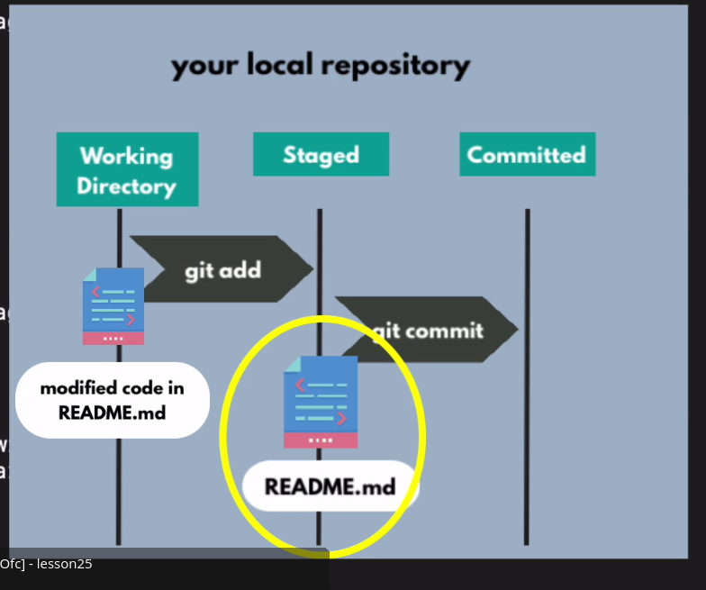
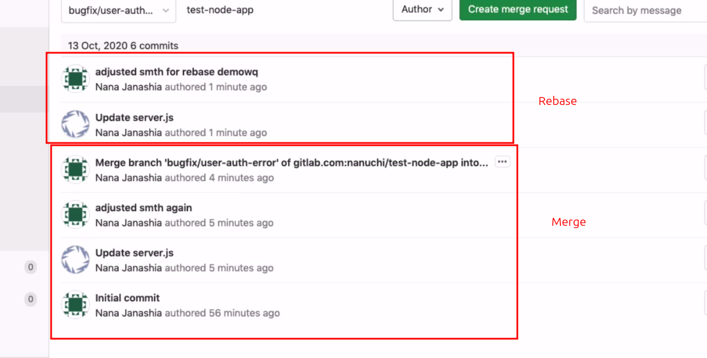

`git status` is used to see which are changes made but not added in staging area
then add it via `git add <file>`

git stage and add is same



we can remove cache of git via `git rm -r --cached .`

say we added  a new file in gitignore that was already pushed. When we remove cached and commit and push it will be removed from the repo

`git commit --amend` is a command used to modify your very last commit instead of creating a brand new one. It combines any currently staged changes with your previous commit, effectively overwriting it in your local history

`git switch --orphan test-v2` we can create a new branch using this with empty things
`git branch -m or -M <new name>` this move the current branch to a new  locally then we need to push

**`-m`** **(Safe Rename)** It renames the branch but **stops and fails** if a branch with the new name already exists.

**`-M`** **(Force Rename)** It forces the rename, completely deleting/overwriting any existing branch with that target name.

`git branch -d <name of branch>` to delete

<br />

The `--set-upstream` flag (shorthand: `-u`) in `git push` **links your current local branch to a specific remote branch**. This process converts your local branch into a "tracking branch".

<br />

```bash
# Create a new local feature branch
git checkout -b feature-login

# Push and link it to the remote server ('origin') for the first time
git push --set-upstream origin feature-login

# Shorthand version of the exact same command
git push -u origin feature-login

# For all future updates on this branch, just type:
git push
```

there are 2 types of merging we can do 1. normal merge add 2. rebase

say i made a change in my local repo and another developer made change on remote repo. and if i try to push my local repo i will need to pull the change that were already made to my local repo and then only i will be able to push.  it mean my local change will be merged with the remote one

if i do normal `git pull` then first it will pull the changes and then create a new commit on top of my commit and the new commit will be  merge commit and then if i push it will push 2 commit.
but we can avoid the merge commit if we do it via `git pull -r` this mean rebase. so it will pull the code with new changes and stack our commit on that no merge commit will be created.



`git rebase` make the history clean while `git merge` make messy branch

`git fetch` will download history  but unlike pull it wont merge

when doing `git pull` sometime we might need to merge instead of rebase use `--no-rebase` flag

error: Your local changes to the following files would be overwritten by merge: app/api/v1/routers/ai\_tutor/ws\_route.py app/services/AI/AI\_services.py Please commit your changes or stash them before you merge. Aborting

this occurs when we have changes to make on a branch and that branch is already ahead and have modified same files
2 options we have here 1. save the change and merge the code 2. reset the local conflicting file or whole

saving

```
git stash # save 
git merge <branch-name>
# OR if you were doing a pull: git pull
git stash pop # add the saved after merge
```

reset

```
git checkout -- app/api/v1/routers/ai_tutor/ws_route.py app/services/AI/AI_services.py
#or
git reset --hard
#or
git reset --hard HEAD~4 # this will delete last 4 commit
```

| Command             | Moves `HEAD`? | Keeps Staging Area? (Changes staged) | Keeps Local Files? (Working directory) | Risk Level    |
| :------------------ | :------------ | :----------------------------------- | :------------------------------------- | :------------ |
| `git reset --soft`  | Yes           | **Yes** (Preserves as staged)        | **Yes** (Untouched)                    | Safe          |
| `git reset --mixed` | Yes           | **No** (Cleared)                     | **Yes** (Untouched)                    | Safe          |
| `git reset --hard`  | Yes           | **No** (Cleared)                     | **No**(Overwritten/Deleted)            | **Dangerous** |

if the mistake commit is already pushed to the remote git repo and we want to delete last 1 commit then we will first delete the commit via `git reset` and then we need to push that changes to the remote however the normal push wont work it will say we need to do `git pull` because the local repo is 1 commit behind (the one we removed). to force the change `git push --force` should be used.

however this is not recommended doing in a master branch or dev branch because many developer have already might have pulled and if they try to push it will create problem. better alternative is to do **revert** instead of reset

`git revert <commit hash>` this will create a new commit which will make inverted code changes

we can also use `git checkout <commit hash>` to go to any commit

`git merge <source branch>`

If you want to view a combined view of every single line added or removed across your entire repository, omit the file path:

- **Unstaged changes:** `git diff` 
- **Staged changes:** `git diff --staged` 

