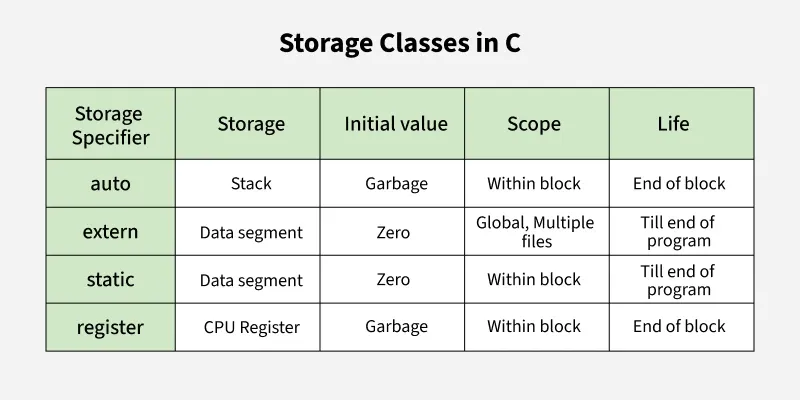
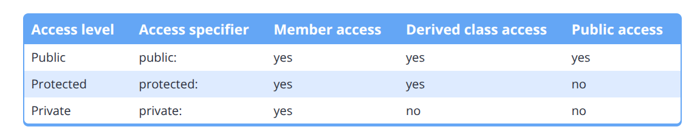

# C++

## Contents

1. C++ basics: objects, variables, initialization, input, and output
2. Functions, namespaces, preprocessing, and multiple files
3. Fundamental data types, literals, constants, and strings
4. Operators and bit manipulation
5. Scope, duration, linkage, and storage classes
6. Control flow
7. Type conversion
8. Function overloading and templates
9. References, pointers, passing arguments, dynamic memory, and arrays
10. Structs, classes, constructors, access levels, and friends

***

# 1. C++ basics

## Structure of a C++ program

The <code>main</code> function is the entry point of a C++ program. A program starts running from <code>main()</code>.

```cpp
#include <iostream>

int main()
{
    std::cout << "Hi\n";
    return 0;
}
```

## Objects and variables

In C++ we can access memory via objects. An object represents a region of storage, such as memory or a CPU register.

We can initialize a variable in three ways:

```cpp
int a = 5;   // copy initialization
int b(5);    // direct initialization
int c{ 5 };  // list initialization
```

List initialization is generally better because it does not allow narrowing conversions, so it can catch data loss and some mistakes at compile time. We can also do multiple initializations in one statement when needed.

For an unused variable, we can use <code>[[maybe_unused]]</code> before the declaration. This is useful when we want to avoid an unused-variable compiler warning.

```cpp
[[maybe_unused]] int unusedValue{};
```

An uninitialized local variable can contain an indeterminate value. We should initialize variables when we declare them.

## Input and output: iostream, cout, cin, and endl

The <code>\<iostream></code> header is needed for input and output.

- <code>std::cout</code> means character output.
- <code>std::cin</code> means character input.
- <code><<</code> is the insertion operator when used with <code>std::cout</code>.
- <code>>></code> is the extraction operator when used with <code>std::cin</code>.

```cpp
#include <iostream>

int main()
{
    int x{};

    std::cout << "Hi, this is value of x: " << x << '\n';
    std::cin >> x;
    std::cout << "Now x is: " << x << '\n';

    return 0;
}
```

<code>std::cout</code> is buffered. This means output is often stored in a buffer first and then sent to the console later.

<code>std::endl</code> writes a newline and flushes the output buffer, so it is slower than <code>'\n'</code>. We normally use <code>'\n'</code> and use <code>std::endl</code> only when we actually need a flush.

<code>std::cin</code> is also buffered, and we can use multiple extractions:

```cpp
int x{};
int y{};

std::cin >> x >> y;
```

If we enter <code>5 7</code>, the first extraction reads <code>5</code> and the second reads <code>7</code>. A space, tab, or newline can separate them.

### cin >> behavior — quick notes

- <code>std::cin >></code> reads one whitespace-delimited token and skips leading whitespace such as spaces, tabs, and newlines.
- It does not wait for a fresh Enter when data is already in the input buffer.
- So <code>1 2</code> typed on one line, or <code>1</code> and <code>2</code> typed on separate lines, work the same way for two <code>std::cin >> int</code> reads.
- A leftover newline is mainly a problem when <code>std::getline</code> follows <code>std::cin >></code>. Before <code>getline</code>, we can write:

```cpp
#include <limits>

std::cin.ignore(std::numeric_limits<std::streamsize>::max(), '\n');
```

- A failed extraction, for example entering <code>abc</code> for an <code>int</code>, sets the fail state and leaves the bad characters in the input buffer. Future reads fail until we fix it:

```cpp
std::cin.clear();
std::cin.ignore(std::numeric_limits<std::streamsize>::max(), '\n');
```

- Check <code>std::cin.fail()</code> after input that can be invalid.
- One line to remember: <strong>>> stops at whitespace, consumes only what it reads, and never auto-clears errors.</strong>

## Literals, parameters, and arguments

Literals are fixed values inserted directly into the source code. For example, <code>5</code>, <code>1.2</code>, and <code>"Hello world!"</code> are literals.

A parameter is a variable used in a function definition. An argument is the value passed by the caller.

```cpp
int add(int a, int b) // a and b are parameters
{
    return a + b;
}

int result{ add(2, 3) }; // 2 and 3 are arguments
```

## Forward declarations and naming conflicts

We can write a function declaration at the beginning of the program, then define the function after <code>main()</code>.

```cpp
int add(int a, int b); // forward declaration

int main()
{
    return add(2, 3);
}

int add(int a, int b)
{
    return a + b;
}
```

If two identifiers have the same name in the same scope, it produces a naming conflict. We can avoid such collisions by using local variables, different scopes, or namespaces. A common naming convention for a global variable is to start its name with <code>g\_</code>, such as <code>g\_count</code>.

***

# 2. Functions, namespaces, preprocessing, and multiple files

## Namespaces and the scope resolution operator

A namespace is like creating a scope so that we can avoid name collisions. We use the scope resolution operator <code>::</code> to access names inside a namespace.

```cpp
namespace Rishi
{
    int age{ 5 };

    void bedtime()
    {
    }
}

int main()
{
    int age{ 10 };
    return Rishi::age;
}
```

We can define a namespace in global scope or inside another namespace. A namespace cannot be defined inside a function.

## The preprocessor

The preprocessor runs before compilation and produces a translation unit, which is then compiled by the compiler. Linking happens after compilation: the linker combines object files and libraries into the final program. Together, preprocessing, compilation, and linking are normally called the build process.

Some important work of the preprocessor is:

1. Remove comments.
2. Resolve <code>#include</code>.
3. Expand macros made with <code>#define</code>.

Things that start with <code>#</code> are usually called preprocessor directives. They are handled during preprocessing, and the preprocessor does not understand normal C++ syntax.

```cpp
#include <iostream>

#define JOE

int main()
{
#ifdef JOE
    std::cout << 1 << '\n';
#endif
    return 0;
}
```

In the case of a macro, the identifier is replaced by its replacement text.

## Header files and header guards

When making multiple files, for example <code>add.cpp</code> and <code>main.cpp</code>, we can put a function declaration in a header file. Then every file that needs the declaration can include the header.

The header file consists of a function declaration and a header guard.

```cpp
// add.h
#ifndef ADD_H
#define ADD_H

int add(int a, int b);

#endif
```

Header guards stop the same header from being included more than once in one translation unit.

***

# 3. Fundamental data types, literals, constants, and strings

## Fundamental data types

There are many fundamental data types. My notes divide them into these categories:

1. <code>void</code>
2. Null pointer type: <code>std::nullptr\_t</code>
3. Floating-point types
4. Integer types
5. <code>bool</code>
6. Character types

### Integer types

Integer types store whole numbers.

- <code>short int</code>
- <code>int</code>
- <code>long int</code>
- <code>long long int</code>

Any data type can hold 2<sup>n</sup> values, where <code>n</code> is the number of bits.

We can create an unsigned data type by writing <code>unsigned</code>.

```cpp
unsigned int count{};
```

If we assign a negative value to an unsigned value, it wraps around modulo 2<sup>n</sup>. For example, converting <code>-1</code> to an unsigned integer gives the highest value that type can store. This is unsigned wraparound, so we should avoid unsigned integers for normal arithmetic unless we really need their behaviour.

For signed integers, overflowing the valid range is undefined behavior.

### Fixed-width integers and size\_t

C++ only promises minimum ranges for types such as <code>int</code>, and the exact size can vary by system. Fixed-width types are useful when we need an exact size and want code that is less platform-dependent.

We use them through <code>\<cstdint></code>:

```cpp
#include <cstdint>

std::int8_t smallNumber{};
std::uint8_t smallUnsignedNumber{};
std::int16_t mediumNumber{};
std::uint16_t mediumUnsignedNumber{};
std::int32_t number{};
std::uint32_t unsignedNumber{};
std::int64_t bigNumber{};
std::uint64_t bigUnsignedNumber{};
```

<code>std::int8\_t</code> and <code>std::uint8\_t</code> may behave like character types when printed. <code>std::size\_t</code> is the unsigned type generally used for sizes and indexes.

### Floating-point types

The floating-point types are:

- <code>float</code>
- <code>double</code>
- <code>long double</code>

For scientific notation, we can write something like:

```cpp
double x{ 8.0e10 };
```

By default, <code>std::cout</code> prints floating-point values with a precision of 6 digits. We can change that with <code>std::setprecision()</code>, which needs <code>\<iomanip></code>.

```cpp
#include <iomanip>
#include <iostream>

std::cout << std::setprecision(10) << 1.23456789 << '\n';
```

When a floating-point literal has no suffix, it is <code>double</code>. A suffix <code>f</code> makes it <code>float</code>.

```cpp
double d{ 200.5 };
float f{ 200.5f };
```

Floating-point values have a sign, exponent, and significand (also called mantissa). A finite number cannot store every possible real number, so rounding error happens. Floating-point also has special values such as infinity, NaN, and positive and negative zero.

## Boolean values

We can do:

```cpp
bool a{ true };
bool b{ false };
bool c{ !true };
bool d{ !false };
bool e{ 1 };
bool f{ 0 };
// bool g{ 2 }; // not allowed: narrowing conversion in list initialization

bool g = 2; // allowed with copy initialization and evaluates to true
```

When printing bool values:

```cpp
std::cout << a << std::endl; // prints 1 if a is true and 0 if false
```

If we want to print <code>true</code> or <code>false</code>, we use:

```cpp
std::cout << std::boolalpha; // manipulates cout; it does not output text itself
std::cout << a << '\n';
std::cout << std::noboolalpha; // reset back as before
```

### Input of boolean values

We can use normal boolean input:

```cpp
bool b{};
std::cin >> b;
// 0 becomes false and non-zero numeric input becomes true
```

If we want to take <code>true</code> and <code>false</code> as input, then we apply <code>boolalpha</code> to <code>std::cin</code>.

```cpp
std::cin >> std::boolalpha;
std::cin >> b; // enter lowercase true or false; another word makes extraction fail
std::cin >> std::noboolalpha;
```

## Characters and the null pointer type

Character types include:

- <code>char</code>
- <code>wchar\_t</code>
- <code>char8\_t</code>
- <code>char16\_t</code>
- <code>char32\_t</code>

These are integral types, so they are stored as numbers in memory.

<code>nullptr</code> is the modern null pointer literal. Its type is <code>std::nullptr\_t</code>.

## Literals, suffixes, and numeral systems

We have suffixes we can add to literals:

```cpp
#include <iostream>

int main()
{
    std::cout << 5 << '\n';  // 5 without a suffix is int by default
    std::cout << 5L << '\n'; // long
    std::cout << 5u << '\n'; // unsigned int

    return 0;
}
```

Numeral systems:

```cpp
int hexVar{ 0x1A };    // hexadecimal: 1A is 26 in decimal
int octVar{ 055 };     // octal: 055 is 45 in decimal
int binVar{ 0b11010 }; // binary: 11010 is 26 in decimal, available since C++14
```

We can use <code>'</code> to separate digits:

```cpp
int mask{ 0b1011'0010 };
```

By default the data printed by <code>std::cout</code> is decimal, but we can use output manipulators:

```cpp
#include <iostream>

int main()
{
    int x{ 12 };
    std::cout << x << '\n';          // decimal by default
    std::cout << std::hex << x << '\n'; // hexadecimal
    std::cout << x << '\n';          // still hexadecimal
    std::cout << std::oct << x << '\n'; // octal
    std::cout << std::dec << x << '\n'; // return to decimal
    std::cout << x << '\n';          // decimal

    return 0;
}
```

To output binary, there is a standard library class called <code>std::bitset</code>:

```cpp
#include <bitset>
#include <iostream>

int main()
{
    std::bitset<8> bits{ 0b0010'0010 };
    std::cout << bits << '\n';

    return 0;
}
```

## Constants, the as-if rule, and compile-time programming

The as-if rule says the compiler can modify code in any way to optimize it as long as there is no observable change in the program's behavior.

It can do this through:

1. Constant folding.
2. Constant propagation.
3. Dead code elimination.

Compile-time programming is a technique that shifts some execution of logic to build time, which can make the program faster at runtime.

Many compile-time features use constant expressions. A constant expression is an expression that can be evaluated at compile time. Expressions that must wait for runtime input are runtime expressions.

```cpp
#include <iostream>

int getNumber()
{
    std::cout << "Enter a number: ";
    int y{};
    std::cin >> y; // can only execute at runtime

    return y;
}

int five()
{
    return 5; // the function itself is not constexpr, so a call to five() is a runtime expression
}

int main()
{
    5;                  // constant expression
    1.2;                // constant expression
    "Hello world!";     // constant expression
    5 + 6;              // constant expression
    1.2 * 3.4;          // constant expression
    8 - 5.6;            // constant expression
    sizeof(int) + 1;    // constant expression

    getNumber();        // runtime expression
    five();             // runtime expression
    std::cout << 5;     // runtime expression

    return 0;
}
```

<code>const</code> means that a variable cannot be modified after initialization. <code>constexpr</code> means the value is usable in a constant expression and requires compile-time evaluation when the context needs it. We use <code>constexpr</code> when we want the compiler to evaluate a value at compile time.

## String

C-style strings are difficult to work with. Modern C++ gives us <code>std::string</code> and <code>std::string\_view</code>. They are class types, not fundamental types.

We use <code>std::string</code> from the <code>\<string></code> header:

```cpp
#include <iostream>
#include <string>

int main()
{
    std::string name{ "Rishi" };
    std::cout << name << '\n';

    name = "another text of any length";
    std::cout << name << '\n';

    return 0;
}
```

Behind the scene, <code>std::string</code> manages its own dynamic memory when needed. We can use it much like a normal variable.

Getting input can be a little problem because normal <code>std::cin</code> stops at whitespace. To get a whole sentence, we use <code>std::getline</code>.

```cpp
#include <iostream>
#include <string>

int main()
{
    std::string text{};
    std::getline(std::cin >> std::ws, text);
    std::cout << text << '\n';

    return 0;
}
```

<code>std::ws</code> ignores leading whitespace before <code>getline</code> starts reading. It is an input manipulator, similar to how <code>std::setprecision()</code> is an output manipulator.

We can get the length of a string using <code>stringVar.length()</code> or <code>stringVar.size()</code>. It returns an unsigned size type and does not include the terminating null character used by <code>c\_str()</code>.

Normal double-quoted text is a string literal, which has C-style character-array behavior. We can make a <code>std::string</code> literal using the <code>s</code> suffix:

```cpp
#include <string>

using namespace std::string_literals;

std::string name{ "Rishi"s };
```

Passing a <code>std::string</code> by value can copy its data, so for read-only function parameters we usually use <code>std::string\_view</code> or <code>const std::string&</code>, depending on the situation.

***

# 4. Operators and bit manipulation

## Side effects and the conditional operator

In C++, a side effect is any action that modifies the state of the execution environment or causes observable changes beyond computing and returning a value. Common examples include modifying a variable, writing to a file, taking user input, or printing to the console.

For example, in <code>x = 5;</code>, calculating <code>5</code> is the expression's value computation, while storing <code>5</code> in <code>x</code> is the side effect.

Understanding side effects is important when dealing with evaluation order. Avoid modifying and reading the same variable in one complicated expression.

<code>a ? x : y</code> is called the conditional operator, or arithmetic if. If <code>a</code> is true, the expression evaluates to <code>x</code>; otherwise, it evaluates to <code>y</code>.

## Bit operations

```cpp
#include <bitset>
#include <iostream>

int main()
{
    std::bitset<8> bits{ 0b0000'0101 }; // 0000 0101
    bits.set(3);   // 0000 1101
    bits.flip(4);  // 0001 1101
    bits.reset(4); // 0000 1101

    std::cout << "All the bits: " << bits << '\n';
    std::cout << "Bit 3 has value: " << bits.test(3) << '\n';
    std::cout << "Bit 4 has value: " << bits.test(4) << '\n';

    return 0;
}
```

# 5. Scope, duration, linkage, and storage classes

## Compound statements, scope, and shadowing

A compound statement is a block surrounded by braces:

```cpp
{
    int x{};
}
```

Scope means where an identifier can be accessed in the source code.

There are three main types of scope in these notes:

1. Global scope.
2. Local scope.
3. Block scope.

Variable shadowing means a higher-scope variable is hidden by another variable with the same name in a lower scope.

```cpp
#include <iostream>

int g_foo{ 5 };

int main()
{
    std::cout << g_foo << '\n'; // prints 5

    int g_foo{ 10 };            // shadows the global variable
    std::cout << g_foo << '\n'; // prints 10

    return 0;
}
```

This happens when we reinitialize or redeclare a variable in a smaller scope.

## Duration and linkage

Linkage tells us whether declarations of an identifier refer to the same entity across scopes or files.

- Local variables have no linkage.
- Global variables and functions can have internal or external linkage.
- A global variable with internal linkage is also called an internal variable.

Storage duration means when the variable is created and destroyed:

1. Automatic duration.
2. Static duration.
3. Dynamic duration, which comes from dynamic memory allocation.

Storage class specifiers are keywords used in variable and function declarations. They can affect storage duration and linkage.

### Global variables

```cpp
// Non-constant global variables
int g_x;                 // zero-initialized by default
int g_value{};           // explicitly value-initialized
int g_count{ 1 };        // explicitly initialized

// Const global variables
// const int g_y;        // error: const variables must be initialized
const int g_y{ 2 };

// Constexpr global variables
// constexpr int g_z;    // error: constexpr variables must be initialized
constexpr int g_z{ 3 };
```

By default, non-constant global variables have external linkage. To make one internal, we can use <code>static</code>:

```cpp
static int g_foo{ 5 };
```

Global <code>const</code> and <code>constexpr</code> variables have internal linkage by default. Functions have external linkage by default.

```cpp
// add.cpp
[[maybe_unused]] static int add(int x, int y)
{
    return x + y;
}
```

```cpp
// main.cpp
#include <iostream>

int add(int x, int y); // a forward declaration does not make the static function accessible

int main()
{
    std::cout << add(3, 4) << '\n';
    return 0;
}
```

This program will not link because <code>add</code> has internal linkage in <code>add.cpp</code>.

We can use <code>extern</code> for an external variable declaration, but we must be careful: an initialized non-const global with <code>extern</code> is a definition, not just a declaration.

### Static local variables

When we create a local variable, it has automatic duration by default. If we use <code>static</code> with a local variable, its duration becomes static. It is created once, keeps its value after leaving its block, and is destroyed at program end.

```cpp
#include <iostream>

void incrementAndPrint()
{
    static int s_value{ 1 }; // initializer runs only once
    ++s_value;
    std::cout << s_value << '\n';
} // s_value becomes inaccessible here but is not destroyed here

int main()
{
    incrementAndPrint();
    incrementAndPrint();
    incrementAndPrint();

    return 0;
}
```

## Inline functions and variables

Calling a function normally has some call overhead. An <code>inline</code> function gives the compiler permission to replace a call with the function body when it is useful. It does not force the compiler to do so.

<code>inline</code> is also useful for allowing identical function or variable definitions in more than one translation unit.

Although we can make a <code>constexpr</code> variable externally linked, it must be initialized at its definition, so it cannot be separately forward declared as <code>constexpr</code>.

## Old storage-class notes

The old types written in my copy are <code>static</code>, <code>extern</code>, <code>register</code>, and <code>auto</code>.

- <code>auto</code> is now mainly used for type deduction in modern C++.
- <code>register</code> is no longer useful in modern C++ and is deprecated.
- <code>static</code> has several meanings depending on where it is used.
- <code>extern</code> is used for external linkage declarations.

The picture below is a quick old-style storage-class reference. In modern C++, use the scope, duration, and linkage notes above as the main rule.



***

# 6. Control flow

## Control statements

Control statements decide which statements execute. A basic <code>switch</code> looks like this:

```cpp
switch (x)
{
case 1:
    return 1;
case 2:
    return 2;
default:
    return 0;
}
```

<code>std::exit()</code> stops the program immediately. We can give a function a name and call it when we need it.

***

# 7. Type conversion

## Type conversion

There are implicit type conversions and explicit type conversions. When the compiler converts the type for us, it is implicit. When we ask for the conversion, it is explicit.

The <code>static\_cast</code> operator is used for a normal explicit type cast:

```cpp
static_cast<int>(5.5); // gives 5
```

Syntax:

```cpp
static_cast<new_type>(expression)
```

The older C-style cast also exists:

```cpp
int number{ (int)5.5 };
```

But in C++, we prefer <code>static\_cast\<int>(5.5)</code> because it clearly shows the intended conversion.

# 8. Function overloading and templates

## Function overloading

Sometimes we might want to create two functions with the same name. For that, we need function overloading.

We can differentiate overloaded functions through the number of parameters and the types of parameters. Return type is not used to differentiate functions during overload resolution.

```cpp
int add(int x, int y)
{
    return x + y;
}

int add(int x, int y, int z)
{
    return x + y + z;
}
```

The function signature is the parts of the function header used to differentiate functions. In C++, this includes the function name, number of parameters, parameter types, and function-level qualifiers. It does not include the return type.

The process of matching a function call to one overloaded function is called overload resolution. A simplified order is:

1. Exact match.
2. Numeric promotion.
3. Numeric conversion.
4. User-defined conversion.
5. Give up with an error.

### Resolving ambiguous matches

Explicitly cast ambiguous argument(s) to match the type of the function we want to call.

Sometimes we want to delete overloads:

```cpp
#include <iostream>

void printInt(int x)
{
    std::cout << x << '\n';
}

void printInt(char) = delete; // calls halt compilation
void printInt(bool) = delete; // calls halt compilation

int main()
{
    printInt(5);      // okay
    // printInt('a'); // error
    // printInt(true); // error

    return 0;
}
```

If there are many non-matching types, we can use a deleted template:

```cpp
template <typename T>
void printInt(T) = delete;
```

We can also define default parameters in a function. The important rule is that after one parameter has a default argument, every parameter to its right must also have a default argument.

## Function templates

When doing function overloading, there are times when we need almost identical functions that only differ by type. In that case, we create a template. The compiler generates overloads from it, so we maintain only one template.

The initial function template is the primary template. Functions generated from it are instantiated functions.

```cpp
template <typename T>
T add(T x, T y)
{
    return x + y;
}
```

When creating a primary function template, we use <code>typename</code> and a type called a template type parameter or template type.

To create a template function, add the <code>template</code> keyword:

```cpp
template <typename T>
T add(T x, T y)
{
    return x + y;
}
```

The compiler can deduce template arguments from a call:

```cpp
#include <iostream>

int main()
{
    std::cout << add(1, 2) << '\n'; // T is deduced as int
}
```

We can also specify the type:

```cpp
std::cout << add<int>(1, 2) << '\n';
```


For a simple template such as <code>max</code>:

```cpp
template <typename T> // T is a placeholder
T max(T x, T y)
{
    return (x < y) ? y : x;
}
```

After using <code>max(1, 2)</code>, the compiler can generate an <code>int</code> version:

```cpp
// Conceptually, the generated function is like this:
int max(int x, int y)
{
    return (x < y) ? y : x;
}
```

This generated function is an instantiation. Implicit instantiation means it is instantiated when a function call needs it.

We can have multiple template types:

```cpp
template <typename R, typename T1, typename T2>
R convert(T1 a, T2 b)
{
    return static_cast<R>(a + b); // calculation using a and b
}

// Called explicitly like: convert<int>(5.5f, 2.1f);
```

```cpp
template <typename T1, typename T2>
auto add(T1 a, T2 b)
{
    return a + b; // return type is automatically deduced
}
```

Template argument deduction means that most of the time we do not need to write a template argument. For example, <code>add(arg1, arg2)</code> can let the function template deduce the parameter types itself.

We can mix normal values and template variables if the template parameter can be deduced. We can also have multiple template variables.

### Overloading function templates

```cpp
#include <iostream>

template <typename T>
auto add(T x, T y)
{
    return x + y;
}

template <typename T, typename U>
auto add(T x, U y)
{
    return x + y;
}

template <typename T, typename U, typename V>
auto add(T x, U y, V z)
{
    return x + y + z;
}

int main()
{
    std::cout << add(1.2, 3.4) << '\n';
    std::cout << add(5.6, 7) << '\n';
    std::cout << add(8, 9, 10) << '\n';

    return 0;
}
```

***

# 9. References, pointers, passing arguments, dynamic memory, and arrays

## Pointers

A pointer is declared using <code>*</code>. A pointer stores an address. When we access the data stored at the address in a pointer using* *<code>*</code>, we call it dereferencing.

The <code>\*</code> token can also be multiplication, so its meaning depends on the context. A token can have a defined meaning depending on whether it is a keyword, identifier, constant, literal, operator, or special symbol.

```cpp
int value{ 5 };
int* ptr{ &value };

*ptr = 10; // dereferencing: value becomes 10
```

## Passing by pointer

Passing by pointer means we pass an address from the calling side. It can change the original variable.

```cpp
void work(int* a)
{
    *a = 11; // dereferencing
}

int main()
{
    int value{ 8 };
    work(&value); // passing address
}
```

## Passing into a function

There are three main ways to pass a value into a function:

1. By value.
2. By reference.
3. By pointer.

### Pass by value

Pass by value is the default in C++. The data is copied into the parameter. Changes inside the function do not go outside the function.

```cpp
void work(int a)
{
    a = 10;
}
```

### Pass by reference

With pass by reference, changes inside the function are reflected outside. No copy is made.

```cpp
void work(int& a)
{
    a = 10;
}
```

For a read-only value that should not be copied, we often pass by const reference:

```cpp
class Person;

void print(const Person& person);
```

### Pass by pointer

With pass by pointer, the pointer is an input and the function dereferences it to change the original object.

```cpp
void work(int* a)
{
    *a = 11;
}

int main()
{
    int value{ 8 };
    work(&value);
}
```

For a class object, pass by pointer, reference, and value each have different syntax, but they all let us pass the object to a function or method of another class.

## Dynamic memory allocation (DMA)

Dynamic memory allocation is the process of allocating memory for a variable during runtime instead of normal automatic allocation. DMA is usually done using the <code>new</code> and <code>delete</code> operators.

Normal local variables are generally allocated with automatic storage duration and are destroyed when they go out of scope. Dynamically allocated objects are allocated on the free store, often called the heap.

```cpp
int* ptr{ new int };    // allocates an int and returns its address
int* ptr1{ new int{ 2 } };
int* ptr2{ new int(2) };
```

After we are done using the memory, we can delete it:

```cpp
delete ptr;
ptr = nullptr; // set pointer to null after delete
```

A pointer that points to deallocated memory is a dangling pointer.

A memory leak happens when the program loses the memory address and there is no way to free the dynamically allocated memory. The memory can remain allocated until the program closes.

If there is no available space, <code>new</code> normally throws <code>std::bad\_alloc</code>.

In modern C++, raw <code>new</code> and <code>delete</code> are usually avoided when a container or smart pointer can manage the memory safely. The raw examples are here because they are part of my notes.

## Dynamically allocating arrays

We can dynamically allocate arrays like a normal scalar, but use <code>new\[]</code> and <code>delete\[]</code>.

```cpp
int* arr{ new int[5] };
delete[] arr;

int* numbers{ new int[5]{ 1, 2, 3, 4, 5 } };
delete[] numbers;
```

The array variable is a pointer to the first element, so normal indexing works:

```cpp
arr[0] = 5;
arr[4] = 3;
```

There is no built-in way to resize a raw dynamic array after it is initialized. This is one reason we use <code>std::vector</code> instead when we need resizing.

***

# 10. Structs, classes, constructors, access levels, and friends

## Structs, classes, and objects

A class is a user-defined type.

```cpp
Student mike; // Student is the data type, mike is an instance of Student
```

An object is an instance of a type.

Classes can do information hiding with:

- <code>public</code>
- <code>private</code>
- <code>protected</code>

They also give us the ability to create instances of a class.

## Access specifiers

Each element of a class has an access level that determines who can access the member. C++ has three levels:

- <code>public</code>
- <code>private</code>
- <code>protected</code>

Members of a <code>struct</code> are public by default. Members of a <code>class</code> are private by default.

Access functions are manually implemented methods that let us access or manipulate private data in a controlled way.



Classes are not always aggregates. An aggregate is a type that allows direct member initialization using brace-list initialization.

For a class to be an aggregate, the important rules from my notes are:

1. All data members are public.
2. No user-declared constructors.
3. No virtual base classes or virtual functions.
4. No private or protected base classes.

## Constructors and destructors

Constructors and destructors are special functions in a class.

A constructor is automatically called when an object is made. A destructor is automatically called when an object is destroyed, either by <code>delete</code> or when the object goes out of scope.

A constructor:

- has the same name as the class;
- has no return type;
- is automatically called;
- can be overloaded;
- is used to initialize an object.

Types of constructor:

1. Default constructor.
2. Parameterized constructor.
3. Copy constructor.

A default constructor takes no arguments and is usually used to initialize data members with default values.

```cpp
class Person
{
    int height{};

public:
    Person() // default constructor
    {
    }
};
```

A parameterized constructor accepts arguments from outside and uses them to initialize data members. It needs to be public when objects should be created from outside the class.

A copy constructor is a special constructor that creates a new object by copying the data members of an existing object of the same class.

## Member functions and member variables

Functions included in a class are called member functions. Functions that are not members of a class are called free functions.

Member functions can be invoked and created in any order, but data members are initialized in declaration order.

Member functions can also be overloaded, but the overloads should be in that class.

```cpp
#include <iostream>

struct Date
{
    int year{};
    int month{};
    int day{};

    void print()
    {
        std::cout << year << '/' << month << '/' << day;
    }
};

int main()
{
    Date today{ 2020, 10, 14 };

    today.day = 16; // member variables use the member selection operator .
    today.print();  // member functions also use .

    return 0;
}
```

Memory for a class is allocated when an object is created, not when the class itself is declared. Each normal data member has separate memory in each object.

Static data members are shared across all objects of a class. Normal data members get their own copy per object, but a static data member has one shared copy.

## Const class objects and const member functions

We can create a const object of a class:

```cpp
const Person person{};
```

If an object is const, we cannot modify its data members or call a non-const member function on it.

```cpp
#include <iostream>

struct Date
{
    int year{};
    int month{};
    int day{};

    void print() const
    {
        std::cout << year << '/' << month << '/' << day;
    }
};

void doSomething(const Date& date)
{
    date.print(); // works because print is const
}
```

We can have a const and non-const overload:

```cpp
#include <iostream>

struct Something
{
    void print()
    {
        std::cout << "non-const\n";
    }

    void print() const
    {
        std::cout << "const\n";
    }
};
```

## Defining member functions outside the class

Member functions can be declared inside a class and defined outside it. The declaration needs to be inside the class, and the definition uses the scope resolution operator.

```cpp
class Person
{
public:
    void will();
};

void Person::will()
{
}
```

The scope resolution operator should not be used when calling the member function through an object. We call it with the object:

```cpp
Person person{};
person.will();
```

## Friend functions and friend classes

Friend functions can access public, private, and protected data members of a class.

Friend functions are declared inside the class using the <code>friend</code> keyword. They can be member functions or non-member functions, and they are defined with the normal rules for the function.

```cpp
#include <iostream>

class Accumulator
{
private:
    int m_data{ 5 };

    friend void print(const Accumulator& accumulator);
};

void print(const Accumulator& accumulator)
{
    std::cout << accumulator.m_data << '\n';
}
```

In this case, <code>print</code> is not a member function, but it can access the private data of <code>Accumulator</code>.

Friend classes and friend functions are not inherited.

A friend class can also be forward declared, declared as a friend inside another class, and then defined later.

### A member function as a friend

```cpp
#include <iostream>

class Storage;

class Display
{
private:
    bool m_displayIntFirst{};

public:
    Display(bool displayIntFirst)
        : m_displayIntFirst{ displayIntFirst }
    {
    }

    void displayStorage(const Storage& storage);
};

class Storage
{
private:
    int m_nValue{};
    double m_dValue{};

public:
    Storage(int nValue, double dValue)
        : m_nValue{ nValue }, m_dValue{ dValue }
    {
    }

    friend void Display::displayStorage(const Storage& storage);
};

void Display::displayStorage(const Storage& storage)
{
    if (m_displayIntFirst)
        std::cout << storage.m_nValue << ' ' << storage.m_dValue << '\n';
    else
        std::cout << storage.m_dValue << ' ' << storage.m_nValue << '\n';
}

int main()
{
    Storage storage{ 5, 6.7 };
    Display display{ false };
    display.displayStorage(storage);

    return 0;
}
```

